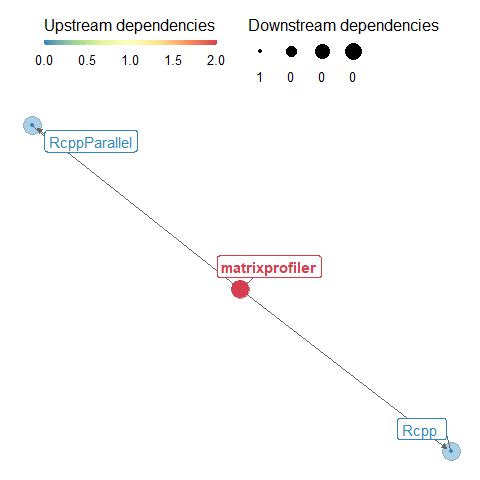

README
================
Francisco Bischoff

25 Jan 2023

<!-- README.md is generated from README.Rmd. Please edit that file -->


## Matrix Profile for R

<!-- badges: start -->

[](https://choosealicense.com/licenses/gpl-3.0/)
[](https://lifecycle.r-lib.org/articles/stages.html)

[](https://github.com/r-lib/lintr)
[](https://r-pkgs.org/r-cmd-check.html)

[](https://app.codecov.io/gh/matrix-profile-foundation/matrixprofiler)
[](https://github.com/github/codeql-action/)
[](https://lgtm.com/projects/g/matrix-profile-foundation/matrixprofiler/context:cpp)

[](https://cran.r-project.org/package=matrixprofiler)
[](https://cran.r-project.org/package=matrixprofiler)

<!-- badges: end -->

### Overview

R Functions implementing UCR Matrix Profile Algorithm
(<http://www.cs.ucr.edu/~eamonn/MatrixProfile.html>).

This package will keep all core functions that will allow you to use the
Matrix Profile concept as a toolkit.

This package provides (almost all) algorithms to build a Matrix Profile.

The package `tsmp` will still be developed as “how we do data mining
with Matrix Profile”, keeping all slow stuff to be handled by this
optimized package.

This will not be covered here, as it is a `tsmp` purpose:

-   Algorithms for MOTIF search for Unidimensional and Multidimensional
    Matrix Profiles.
-   Algorithm for Chains search for Unidimensional Matrix Profile.
-   Algorithms for Semantic Segmentation (FLUSS) and Weakly Labeled data
    (SDTS).
-   Algorithm for Salient Subsections detection allowing MDS plotting.
-   Basic plotting for all outputs generated here.

You can find the current `tsmp` package here:
<https://CRAN.R-project.org/package=tsmp>

### Installation

``` r
# Install the released version from CRAN
install.packages("matrixprofiler")
# Or the development version from GitHub:
# install.packages("devtools")
devtools::install_github("matrix-profile-foundation/matrixprofiler")
```

### Currently available Features

-   STAMP (single and multi-thread versions)
-   STOMP (single and multi-thread versions)
-   SCRIMP (single and multi-thread versions, not for AB-joins yet)
-   MPX (single and multi-thread versions)
-   Misc:
    -   MASS v2.0
    -   MASS v3.0
    -   MASS extensions: UN (Unnormalized Query)
    -   MASS extensions: WQ (Weighted Query)
    -   MASS extensions: ABS (Absolute Query and Data)
    -   Window functions like mov_mean() and others.

### On Roadmap

-   STOMPi (On-line version)
-   Multivariate STOMP (mSTOMP)
-   SiMPle-Fast (Fast Similarity Matrix Profile for Music Analysis and
    Exploration)
-   Exact Detection of Variable Length Motifs (VALMOD) (maybe will stay
    on `tsmp` package)
-   MPdist: Matrix Profile Distance
-   MASS extensions: ADP (Approximate Distance Profile, with PAA)
    (maybe)
-   MASS extensions: QwG (Query with Gap)

### Will stay on TSMP package

-   Time Series Chains
-   Multivariate MOTIF Search (from mSTOMP)
-   Salient Subsequences search for Multidimensional Space
-   Scalable Dictionary learning for Time Series (SDTS) prediction
-   FLUSS (Fast Low-cost Unipotent Semantic Segmentation)
-   FLOSS (Fast Low-cost On-line Unipotent Semantic Segmentation)
-   Annotation vectors (e.g., Stop-word MOTIF bias, Actionability bias)
-   FLUSS Arc Plot and SiMPle Arc Plot
-   Time Series Snippets
-   Subsetting Matrix Profiles (`head()`, `tail()`, `[`, etc.)

### Other projects with Matrix Profile

-   Python: <https://github.com/target/matrixprofile-ts>
-   Python: <https://github.com/ZiyaoWei/pyMatrixProfile>
-   Python: <https://github.com/juanbeleno/owlpy>
-   Python: <https://github.com/javidlakha/matrix-profile>
-   Python: <https://github.com/shapelets/khiva-python>
-   R: <https://github.com/shapelets/khiva-r>
-   Matlab: <https://github.com/shapelets/khiva-matlab>
-   Java: <https://github.com/shapelets/khiva-java>
-   Java: <https://github.com/ensozos/Matrix-Profile>
-   Kotlin: <https://github.com/shapelets/khiva-kotlin>
-   C++ (CUDA and OPENCL): <https://github.com/shapelets/khiva>
-   CUDA: <https://github.com/zpzim/STOMPSelfJoin>
-   CUDA: <https://github.com/zpzim/SCAMP>

### Matrix Profile Foundation

Our next step unifying the Matrix Profile implementation in several
programming languages.

Visit: [Matrix Profile Foundation](https://matrixprofile.org)

### Benchmarks

Available at [RPubs](https://rpubs.com/franzbischoff/matrixprofiler).

### Package dependencies

<center>

<!-- -->

</center>

### Code of Conduct

Please note that the matrixprofiler project is released with a
[Contributor Code of
Conduct](https://contributor-covenant.org/version/2/0/CODE_OF_CONDUCT.html).
By contributing to this project, you agree to abide by its terms.
